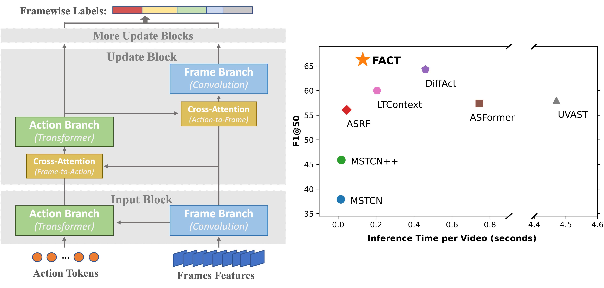

<!-- # CVPR2024-FACT -->
<h2 align="center"> <a href="https://openaccess.thecvf.com/content/CVPR2024/html/Lu_FACT_Frame-Action_Cross-Attention_Temporal_Modeling_for_Efficient_Action_Segmentation_CVPR_2024_paper.html">FACT: Frame-Action Cross-Attention Temporal Modeling for Efficient Supervised Action Segmentation</a></h2>

<!-- https://img.shields.io/badge/any_text-you_like-blue -->

In this work, we propose an efficient Frame-Action Cross-attention Temporal modeling (**FACT**) framework that (i) performs temporal modeling on frame and action levels in parallel and (ii) leverage this parallelism to achieve iterative bidirectional information transfer between action/frame features and refine them. 

We achieve SOTA on four datasets while enjoy lower computational cost.




## Preparation

### 1. Install the Requirements
```shell
pip3 install -r requirements.txt
```

### 2. Prepare Codes
```shell
mkdir FACT_actseg
cd FACT_actseg
git clone https://github.com/ZijiaLewisLu/CVPR2024-FACT.git
mv CVPR2024-FACT src
mkdir data 
```

### 3. Prepare Data
- download Breakfast and GTEA data from [link1](https://zenodo.org/records/3625992#.Xiv9jGhKhPY) or [link2](https://mega.nz/#!O6wXlSTS!wcEoDT4Ctq5HRq_hV-aWeVF1_JB3cacQBQqOLjCIbc8), and place them in `FACT_actseg/data`.
- download EgoProcel and Epic-Kitchens data from [here](https://drive.google.com/drive/folders/1qYPLb7Flcl0kZWXFghdEpvrrkTF2SBrH?usp=sharing), and place them in `FACT_actseg/data`.
- Features for Epic-Kitchens can be downloaded via [this script](https://github.com/epic-kitchens/C2-Action-Detection/blob/master/BMNProposalGenerator/scripts/download_data_ek100_full.sh) and extracted with [utils/extract_epic_kitchen.py](./utils/extract_epic_kitchens.py).
- After this, `FACT_actseg/data` should contain four folders, one for each dataset.

## Training
The training is configured using YAML, and all the configurations are listed in [configs](./configs). You can use the following commands to run the experiments.
```shell
cd FACT_actseg
# breakfast
python3 -m src.train --cfg src/configs/breakfast.yaml --set aux.gpu 0 split "split1"
# gtea
python3 -m src.train --cfg src/configs/gtea.yaml --set aux.gpu 0 split "split1"
# egoprocel
python3 -m src.train --cfg src/configs/egoprocel.yaml --set aux.gpu 0 split "split1"
# epic-kitchens
python3 -m src.train --cfg src/configs/epic-kitchens.yaml --set aux.gpu 0 split "split1"
```
By default, log will be saved to `FACT_actseg/log/<experiment-path>`. Evaluation results are saved as `Checkpoint` objects defined [utils/evaluate.py](./utils/evaluate.py). Loss and metrics are also visualized with wandb.

## Pre-Trained Models
Pre-trained model weights can be downloaded from [here](https://drive.google.com/drive/folders/1yj6bnVwdXZQrx-F29kpjin27Vd30zRnd?usp=sharing). You can place the files under `FACT_actseg/ckpts` and test the models with the following command.
```shell
python3 -m src.eval
```
*We lost the original data and model weights in a disk failure. These models are replicated afterward, thus the performance slightly varies from those in the papers.*

- [x] Breakfast models
- [x] GTEA models
- [x] EgoProceL models
- [ ] Epic-Kitchens models


## Citation
```text
@inproceedings{
    lu2024fact,
    title={{FACT}: Frame-Action Cross-Attention Temporal Modeling for Efficient Supervised Action Segmentation},
    author={Zijia Lu and Ehsan Elhamifar},
    booktitle={Conference on Computer Vision and Pattern Recognition 2024},
    year={2024},
}
```
