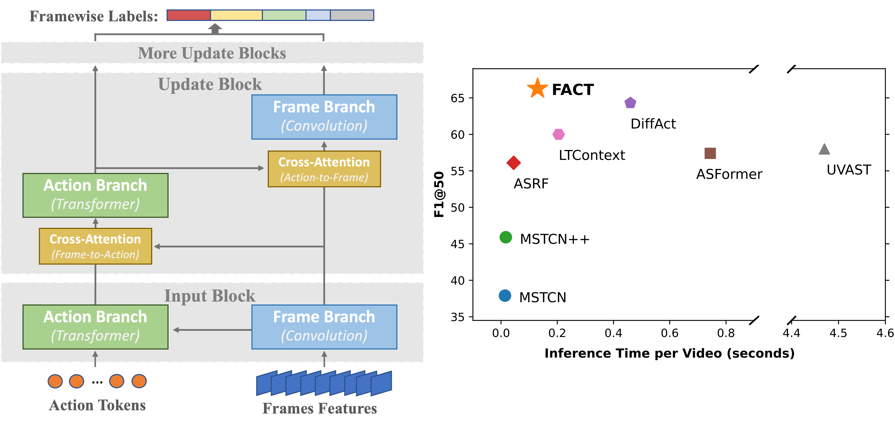

# CVPR2024-FACT
This is the official code for our CVPR 2024 paper, **FACT: Frame-Action Cross-Attention Temporal Modeling for Efficient Fully-Supervised Action Segmentation**.

- Dataset, Code and Model Weights will be released soon.